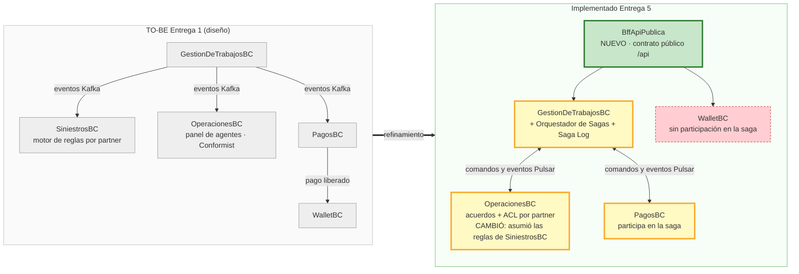
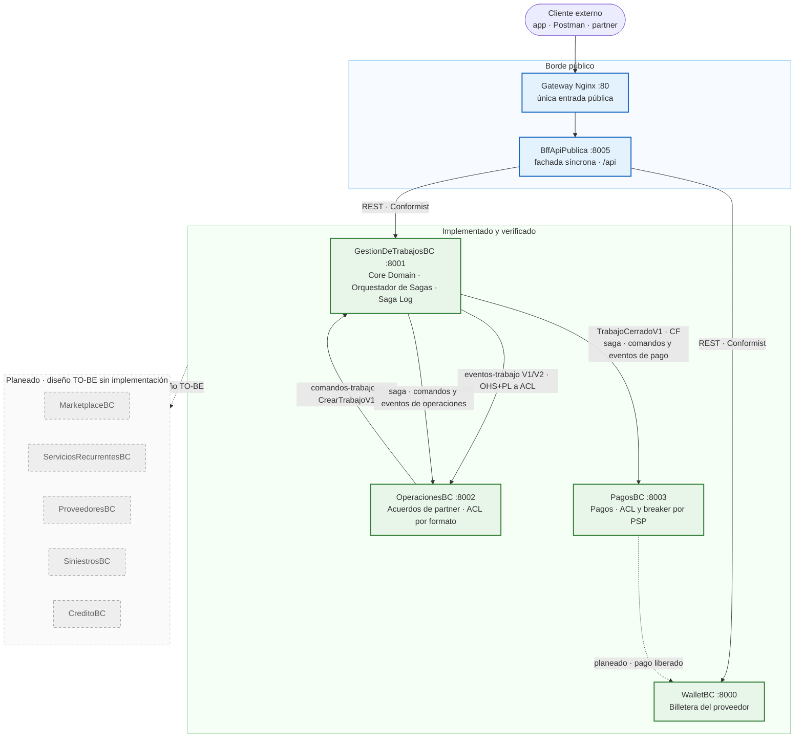
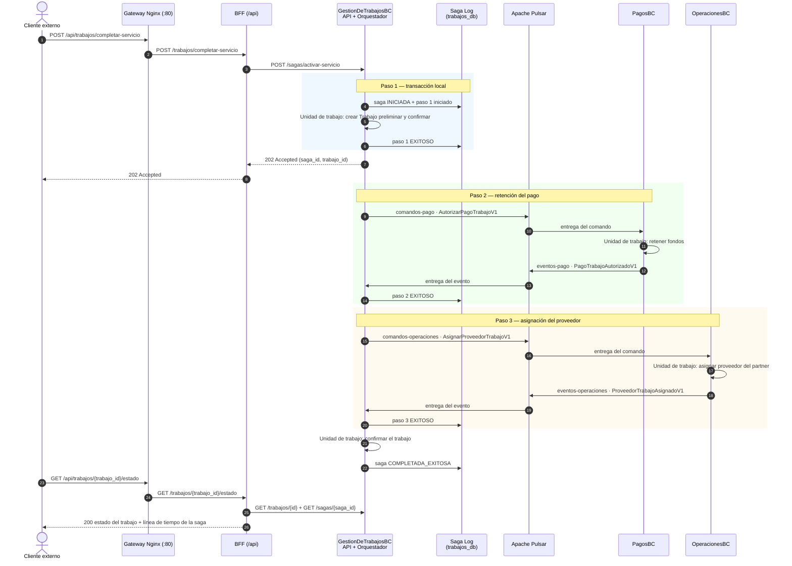
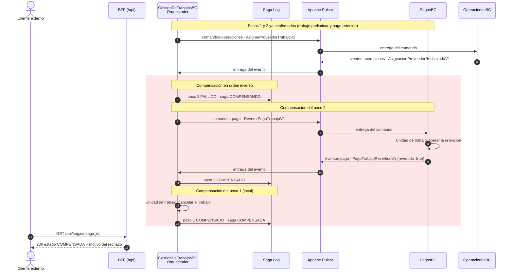
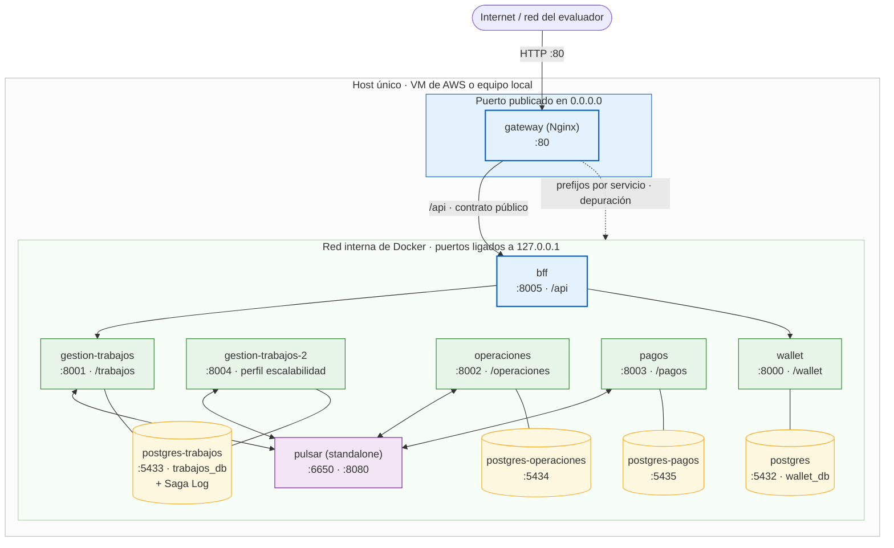

# Refinamiento de Arquitectura TO-BE y Vistas Dinámicas
## Entrega Semana 7 — Hogar de los Alpes

Este documento actualiza la arquitectura objetivo con lo que quedó **efectivamente
implementado y desplegado**: cuatro bounded contexts, un BFF, un gateway como única
entrada pública, una saga orquestada con su Saga Log y Apache Pulsar como backbone de
eventos.

Artefactos relacionados:

- Mapa de contextos refinado en ContextMapper DSL: [`hda-context-map-to-be-refinado.cml`](hda-context-map-to-be-refinado.cml)
- Mapa original de la Semana 2: [`../semana-2/contextos-acotados/hda-context-map-to-be.cml`](../semana-2/contextos-acotados/hda-context-map-to-be.cml)
- Especificación de la saga: [`patron-sagas-y-saga-log.md`](patron-sagas-y-saga-log.md)
- Fachada de clientes: [`backend-for-frontend-bff.md`](backend-for-frontend-bff.md)

---

## 1. Refinamiento del Mapa de Contextos TO-BE

### 1.1 Justificación de Cambios Arquitecturales

| # | Aspecto | TO-BE Semana 2 | Implementado | Por qué cambió |
|---|---|---|---|---|
| 1 | Backbone de eventos | Apache Kafka | **Apache Pulsar** | La decisión quedó detrás del puerto `MessageBroker`, así que no contamina dominio ni aplicación. Pulsar aporta suscripciones `Shared` (reparto de carga del escenario de Escalabilidad #4), `Key_Shared` (orden por trabajo) y *dead letter queue* nativa. |
| 2 | Reglas y acuerdos de partners | En `SiniestrosBC` | En **`OperacionesBC`** | El escenario de Modificabilidad #3 define como artefacto el "adaptador de entrada (ACL) para el nuevo partner en OperacionesBC" y exige **0 % de cambios en el dominio del core**. Poner las reglas junto al motor de trabajos habría obligado a redesplegarlo con cada partner. |
| 3 | Relación core ↔ OperacionesBC | Conformist, solo lectura de eventos | **Anti-Corruption Layer en ambos sentidos** | OperacionesBC no solo consume eventos: traduce el formato propio de cada partner y emite el comando canónico `CrearTrabajoV1`. Ningún formato ajeno entra al core y ningún modelo interno sale sin traducir. |
| 4 | Entrada de clientes | Cada bounded context expone su API | **BFF en `/api` + gateway Nginx en el puerto 80** | Un cliente externo no debe conocer la partición en microservicios ni hablar con Pulsar. El BFF es el contrato público; los prefijos por servicio del gateway quedan para depuración. |
| 5 | Transacción distribuida | No modelada | **Saga por orquestación + Saga Log** | La activación de un servicio compromete dinero retenido y capacidad operativa con un partner. La orquestación centraliza la máquina de estados y ejecuta las compensaciones en orden inverso de forma determinista. |
| 6 | Consistencia dentro de cada servicio | Implícita en el repositorio | **Unidad de trabajo por caso de uso** | El caso de uso decide la transacción, no el adaptador de persistencia. En OperacionesBC eso permite escribir acuerdo y vista del trabajo en una sola transacción. |
| 7 | Contratos entre contextos | "Eventos estándar de ciclo de vida" | **Eventos de integración versionados** (`TrabajoCreadoV1` deprecada y `TrabajoCreadoV2` conviviendo) | Los consumidores tienen ciclos de release propios y los eventos quedan persistidos en el tópico: no existe un instante en que todos migren a la vez. |
| 8 | Alcance | 9 bounded contexts | **4 implementados** (`GestionDeTrabajosBC`, `OperacionesBC`, `PagosBC`, `WalletBC`) **+ BFF** | Los otros cinco siguen siendo válidos como diseño objetivo; se marcan como planeados para no confundir diseño con evidencia. |

**Lo que no cambió:** `GestionDeTrabajosBC` sigue siendo el Core Domain y el upstream
`[OHS, PL]` del que depende el resto. El refinamiento le quitó responsabilidades ajenas
(los partners) y le agregó una que sí le corresponde por ser dueño del agregado `Trabajo`:
coordinar la saga.

### 1.2 Resaltado de cambios: antes y después

El numeral 8.1 de la Entrega 5 pide señalar explícitamente qué cambió frente al mapa de la
Entrega 1. Este par de diagramas aísla esos cambios; el mapa completo está en 1.4.

| Convención | Significado |
|---|---|
| Verde | **Nuevo**: no existía en el TO-BE de la Entrega 1 (el BFF). |
| Amarillo | **Cambió**: el contexto sigue existiendo, pero su responsabilidad o su patrón de relación se movió (el core asumió la orquestación; OperacionesBC asumió las reglas de partner y pasó de Conformist a ACL). |
| Rojo punteado | **Pendiente**: previsto en el plan de la Entrega 5 pero aún sin implementar (WalletBC como participante de la saga). |
| Gris | Sin cambios frente al diseño original. |

### 1.3 Divergencias entre el plan de la Entrega 5 y lo implementado

El mapa refinado documenta **lo que está implementado y verificado**, no lo planeado. Tres
puntos del documento de arquitectura de la Entrega 5 difieren del código, y conviene
resolverlos antes del video para que la sustentación y el repositorio coincidan:

| Punto | Documento de la Entrega 5 | Implementado | Decisión sugerida |
|---|---|---|---|
| Ubicación del orquestador | Dentro de **WalletBC** (numeral 4.1) | Dentro de **GestionDeTrabajosBC**, con el Saga Log en `trabajos_db` | Mantener la implementación: el orquestador es dueño del agregado `Trabajo`, que es el argumento ya escrito en [`patron-sagas-y-saga-log.md`](patron-sagas-y-saga-log.md). Corregir el documento. |
| Participantes de la saga | 5 pasos sobre 4 servicios, con `AcreditarProveedor` en WalletBC (numeral 3.1) | 4 pasos sobre **3 servicios**: GestionDeTrabajosBC, PagosBC y OperacionesBC | Implementar el paso de WalletBC (es el ítem de 19 pts de la rúbrica: saga con ≥4 servicios). Depende del dueño de Wallet. |
| Nomenclatura | `AsignarProveedor`, `RetenerPago`, `EjecutarTrabajo`; estados `PROVEEDOR_ASIGNADO`, `PAGO_RETENIDO`… | `AutorizarPagoTrabajoV1`, `AsignarProveedorTrabajoV1`; estados `INICIADA`, `EN_PROCESO`, `COMPENSANDO`, `COMPENSADA`, `COMPLETADA_EXITOSA`, `FALLIDA` | Adoptar la del código, como pide la propia nota del documento ("renombrar para que el video y el código coincidan"). |

En cuanto WalletBC entre a la saga, este mapa y las vistas de la sección 2 deben actualizarse:
el paso 4 pasa a ser la acreditación al proveedor y la compensación del paso 3 (liberar la
asignación) deja de ser código sin uso.

### 1.4 Definición Formal en ContextMapper

La definición formal está en [`hda-context-map-to-be-refinado.cml`](hda-context-map-to-be-refinado.cml),
con las relaciones agrupadas en **A. implementadas** y **B. planeadas**, y la tecnología de
cada integración declarada en `implementationTechnology`.

**Cómo leer el diagrama**

- **Línea continua:** integración implementada y verificada. **Línea punteada:** relación del
  diseño objetivo, sin código en esta POC.
- Todo lo que cruza entre `GestionDeTrabajosBC`, `OperacionesBC` y `PagosBC` viaja por
  **Apache Pulsar**; nunca hay una llamada REST entre bounded contexts.
- Las dos flechas entre el core y `OperacionesBC` no son redundantes: una es el flujo de
  negocio (solicitud del partner y eventos del trabajo) y la otra es la saga.
- El BFF es el **único** punto por el que entra un cliente externo al negocio.

---

## 2. Vistas Dinámicas y de Proceso

Estas vistas extienden las de [`patron-sagas-y-saga-log.md`](patron-sagas-y-saga-log.md)
hacia el borde del sistema: empiezan en el cliente externo y pasan por el gateway y el BFF,
que es como se ejecuta realmente la demostración.

### 2.1 Flujo Exitoso de la Saga (Happy Path)

Tres decisiones visibles en el diagrama:

- **La respuesta al cliente es 202, no 200.** El trabajo preliminar ya está confirmado, pero
  el pago y la asignación se resuelven de forma asíncrona. El cliente consulta el resultado.
- **El orquestador nunca llama por REST a un participante.** Emite comandos y espera eventos,
  así que la caída de `PagosBC` u `OperacionesBC` no bloquea al core: el comando queda en el
  tópico y se procesa al volver.
- **Cada paso se escribe en el Saga Log antes y después**, lo que permite reconstruir en qué
  punto quedó una transacción.

### 2.2 Flujo Compensatorio ante Fallos

Fallo en el paso 3 (sin proveedor disponible). Las compensaciones se ejecutan en **orden
inverso**: primero se revierte el pago (paso 2) y luego se cancela el trabajo (paso 1).

- La saga permanece en `COMPENSANDO` mientras espera la confirmación del reverso. Solo pasa a
  `COMPENSADA` cuando llega `PagoTrabajoRevertidoV1` con `revertido=true`.
- Si el reverso falla, el paso queda en `ERROR` y la saga termina en `FALLIDA`: queda
  registrada para intervención manual en vez de fingir consistencia.
- El fallo puede forzarse para la demostración con `simular_fallo_en_paso` (`PAGO` u
  `OPERACIONES`) en la solicitud de inicio.

---

## 3. Topología de Despliegue Consolidada

Todo el sistema se levanta con `docker compose up -d --build --wait` desde la raíz del
repositorio, y es la misma topología que corre en la VM de AWS.

### 3.1 Reglas de la topología

| Decisión | Detalle |
|---|---|
| **Una sola puerta pública** | Solo el gateway escucha en todas las interfaces. Las APIs directas, las bases y Pulsar quedan ligadas a `127.0.0.1`: se usan desde la propia máquina, pero no quedan expuestas en la VM aunque el *security group* se abra de más. Para exponerlas a propósito: `IP_PUERTOS_INTERNOS=0.0.0.0`. |
| **Contrato público vs. depuración** | `/api` (BFF) es el contrato de la entrega. Los prefijos `/trabajos`, `/operaciones`, `/pagos` y `/wallet` siguen publicados para inspeccionar cada servicio y su Swagger. |
| **Una base por bounded context** | Ningún servicio lee la base de otro. El Saga Log vive en `trabajos_db`, junto al agregado `Trabajo` que coordina. |
| **Réplica para escalabilidad** | `gestion-trabajos-2` (perfil `escalabilidad`) comparte base y suscripción `Shared`: Pulsar reparte los comandos entre las instancias sin cambios de código. |
| **Pulsar arranca limpio** | El contenedor borra sus datos al iniciar, porque un *standalone* reiniciado no recupera sus ledgers. Los datos de negocio viven en PostgreSQL, con volumen por servicio. |
| **Swagger detrás del prefijo** | Cada API corre con `UVICORN_ROOT_PATH` igual a su prefijo, así que su documentación carga a través del gateway. |

### 3.2 Correspondencia entre contextos y despliegue

| Bounded context | Contenedor | Puerto interno | Ruta pública | Base de datos |
|---|---|---|---|---|
| BffApiPublica | `bff` | 8005 | `/api` | — |
| GestionDeTrabajosBC | `gestion-trabajos` | 8001 | `/trabajos` | `trabajos_db` (+ Saga Log) |
| OperacionesBC | `operaciones` | 8002 | `/operaciones` | `operaciones_db` |
| PagosBC | `pagos` | 8003 | `/pagos` | `pagos_db` |
| WalletBC | `wallet` | 8000 | `/wallet` | `wallet_db` |

> Al llamar los puertos directos use `127.0.0.1` y no `localhost`: no hay listener IPv6 y un
> cliente que resuelva `localhost` intenta `::1` primero, perdiendo unos 2 segundos por
> petición. El gateway no tiene ese problema.

---

## 4. Trazabilidad entre refinamientos y experimentación

El numeral 8.2 pide justificar cada cambio con lo aprendido en la experimentación (sección 7
del documento de la Entrega 5). Esta tabla amarra cada refinamiento con el escenario que lo
sustenta y con la evidencia que debe aportarlo.

| Refinamiento | Escenario de calidad que lo sustenta | Evidencia esperada | Estado de la evidencia |
|---|---|---|---|
| Apache Pulsar en lugar de Kafka, con suscripción `Shared` | Elasticidad ante picos de demanda (4x siniestros) | Latencia p50/p95/p99 y throughput con una y con dos réplicas del core; el reparto de comandos sin cambios de código | Script disponible: [`carga_escalabilidad.py`](../../gestion-trabajos-service/scripts/carga_escalabilidad.py). Resultados pendientes en [`informe-experimentacion.md`](informe-experimentacion.md) |
| Saga orquestada con Saga Log en el core | Consistencia transaccional bajo fallo concurrente | Que no quede dinero retenido sin registro: para N sagas con fallos forzados, el estado del Saga Log debe cuadrar con lo retenido en PagosBC | Scripts disponibles: `probar_saga_orquestada.py --modo compensar-pago` y `--modo compensar-operaciones`. Resultados pendientes |
| Comunicación solo por Pulsar entre contextos (nunca REST entre servicios) | Resiliencia ante caída de un bróker de Pulsar | Sagas en curso que se recuperan solas al restablecer el bróker, frente a las que quedan colgadas; tiempo de recuperación | Pendiente de ejecutar |
| Reglas de partner en OperacionesBC y ACL por formato | Modificabilidad: integrar un partner nuevo | Onboarding de un partner sin tocar ni redesplegar el core (`docker compose up -d --build operaciones`), con el tiempo de actividad del core sin cambios | **Verificado**: 31 checks de los escenarios 9 y 3 en verde, incluido el onboarding de `cooperativa-sur` |
| Circuit breaker por partner y por PSP | Resiliencia ante caída de un partner o un PSP | Que la caída de un partner no degrade a los demás, y la recuperación automática al volver | **Verificado**: el core responde en decenas de milisegundos con el partner caído; recuperación automática sin intervención |
| BFF como única entrada síncrona y gateway como única puerta pública | Transversal a los tres escenarios (superficie de ataque y acoplamiento de clientes) | Clientes que no conocen ni Pulsar ni la partición en microservicios; puertos internos no alcanzables desde la red | **Verificado**: 29 checks del gateway en verde, con los puertos internos rechazando conexión desde la red |

**Cómo cerrar esta sección:** cuando el informe de experimentación tenga los resultados de los
tres escenarios del numeral 7, reemplazar cada "pendiente" por el dato medido y su conclusión.
Si algún resultado contradice un refinamiento —por ejemplo, si el reparto `Shared` no sostiene
el 4x— el cambio correspondiente de este mapa debe revisarse, no solo anotarse.

## 5. Imágenes exportadas

Los cuatro diagramas están además como PNG en [`imagenes/`](imagenes/), para incrustarlos en
la presentación o el informe sin depender del renderizado de Mermaid:

| Vista | Imagen |
|---|---|
| Resaltado de cambios (antes y después) | [`imagenes/cambios-antes-despues.png`](imagenes/cambios-antes-despues.png) |
| Mapa de contextos TO-BE refinado | [`imagenes/mapa-contextos-to-be-refinado.png`](imagenes/mapa-contextos-to-be-refinado.png) |
| Saga — flujo exitoso | [`imagenes/saga-happy-path.png`](imagenes/saga-happy-path.png) |
| Saga — compensación | [`imagenes/saga-compensacion.png`](imagenes/saga-compensacion.png) |
| Topología de despliegue | [`imagenes/topologia-despliegue.png`](imagenes/topologia-despliegue.png) |

El `.mmd` de cada diagrama y las instrucciones para regenerarlos están en
[`imagenes/README.md`](imagenes/README.md).
