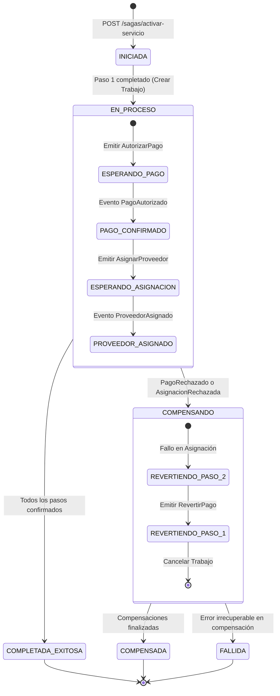
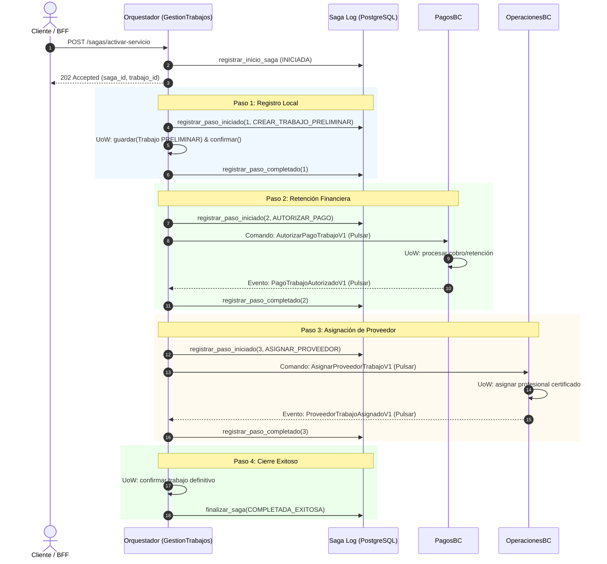
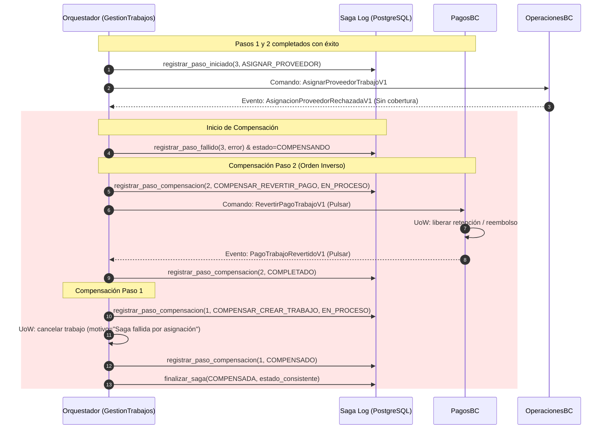

# Especificación del Patrón de Sagas y Saga Log
## Entrega Semana 7 — Hogar de los Alpes (HdA)

Este documento detalla el diseño, especificación técnica, implementación y auditoría de las transacciones distribuidas de larga duración (**Sagas**) y del almacén inmutable de eventos de coordinación (**Saga Log**) en el ecosistema de Hogar de los Alpes, en estricto cumplimiento de los Criterios 1, 2, 3 y 7 de la Semana 7.

---

## 1. Justificación del Patrón Transaccional

### 1.1 Modelo Seleccionado: Orquestación vs. Coreografía

Para coordinar la transacción de negocio de **Activación, Liquidación y Asignación de Trabajos**, se seleccionó el patrón de **Saga por Orquestación**, donde un coordinador centralizado en el Core Domain (`GestionDeTrabajosBC`) gobierna el ciclo de vida de la transacción, emite comandos asíncronos y procesa los eventos de respuesta.

Esta decisión se sustenta en cuatro pilares arquitectónicos:

1. **Visibilidad Global y Observabilidad:**
   En flujos de negocio que involucran dinero en tránsito y compromisos operativos con partners, dispersar el estado entre múltiples servicios mediante coreografía dificulta determinar en qué punto exacto falló una transacción. La orquestación centraliza la máquina de estados, permitiendo alimentar un **Saga Log** persistente con marcas de tiempo, payloads y causales de fallo de forma atómica.
2. **Centralización y Determinismo de la Compensación:**
   Ante un rechazo (ej. fondos insuficientes o indisponibilidad de proveedores), la orquestación ejecuta las transacciones de compensación en **orden estrictamente inverso**, evitando condiciones de carrera (*race conditions*) y garantizando idempotencia. En coreografía, coordinar compensaciones multidireccionales eleva exponencialmente el acoplamiento semántico y el riesgo de inconsistencias temporales.
3. **Prevención de Ciclos y Eventos Pasivo-Agresivos:**
   Se evita el antipatrón de eventos que ocultan comandos implícitos ("los platos están sucios"). Cada intención hacia servicios colaboradores se modela explícitamente como un **Comando** (`AutorizarPagoTrabajoV1`, `AsignarProveedorTrabajoV1`, `RevertirPagoTrabajoV1`), dejando los eventos para anunciar hechos consumados.
4. **Respeto a los Límites de Contexto Acotado (DDD):**
   `GestionDeTrabajosBC` actúa como orquestador al ser el dueño del agregado raíz `Trabajo`. No se introdujo un bus monolítico o ESB satélite anémico, sino un coordinador de aplicación especializado dentro del bounded context núcleo.

### 1.2 Microservicios Participantes en la Transacción

La saga involucra 3 microservicios autónomos, cada uno gobernando su propia base de datos relacional y sus reglas de invariantes mediante arquitectura hexagonal:

| Microservicio (Bounded Context) | Capa / Dominio | Rol en la Saga | Agregado Involucrado |
| :--- | :--- | :--- | :--- |
| **`gestion-trabajos-service`** | Core Domain | **Orquestador y Coordinador:** Inicia la saga, persiste el trabajo preliminar, gobierna el Saga Log, emite comandos y cancela o confirma el trabajo. | `Trabajo` |
| **`pagos-service`** | Supporting / Fintech | **Custodia y Cobro Financiero:** Recibe comandos para autorizar/retener fondos y para ejecutar compensaciones de reverso. | `Pago` |
| **`operaciones-service`** | Supporting / Logística | **Asignación Operativa:** Recibe comandos para asignar proveedores/partners certificados y para liberar asignaciones ante fallos. | `Partner` / `TrabajosDePartner` |

---

## 2. Especificación de la Máquina de Estados de la Saga

### 2.1 Estados Globales y Transiciones

El orquestador materializa el estado global de la transacción en la tabla `saga_instancias`:



### 2.2 Tópicos y Canales de Mensajería sobre Apache Pulsar

La comunicación asíncrona entre el orquestador y los servicios participantes se canaliza mediante tópicos persistentes dedicados en **Apache Pulsar**:

| Tópico Pulsar | Tipo de Mensaje | Emisor | Consumidor | Propósito |
| :--- | :---: | :---: | :---: | :--- |
| `persistent://public/default/comandos-pago` | **Comando** | Orquestador | `pagos-service` | `AutorizarPagoTrabajoV1`, `RevertirPagoTrabajoV1` |
| `persistent://public/default/eventos-pago` | **Evento** | `pagos-service` | Orquestador | `PagoTrabajoAutorizadoV1`, `PagoTrabajoRechazadoV1`, `PagoTrabajoRevertidoV1` |
| `persistent://public/default/comandos-operaciones` | **Comando** | Orquestador | `operaciones-service` | `AsignarProveedorTrabajoV1`, `LiberarAsignacionProveedorV1` |
| `persistent://public/default/eventos-operaciones` | **Evento** | `operaciones-service` | Orquestador | `ProveedorTrabajoAsignadoV1`, `AsignacionProveedorRechazadaV1`, `AsignacionProveedorLiberadaV1` |

Cada mensaje incluye en sus propiedades de cabecera: `command_type` / `event_type`, `saga_id` y `partition_key` (usando el `trabajo_id` para garantizar ordenamiento por partición).

---

## 3. Flujos Transaccionales

### 3.1 Flujo Exitoso (Happy Path)

Todos los pasos avanzan secuencialmente y alcanzan consistencia eventual:



### 3.2 Flujo Compensatorio ante Fallos (Compensación en Orden Inverso)

Demostración del rollback semántico cuando ocurre un fallo en el Paso 3 (`operaciones-service` sin disponibilidad de profesionales):



El orquestador conserva la saga en `COMPENSANDO` después de enviar el comando de
reverso. Solo procesa la compensación local y establece `COMPENSADA` cuando
recibe `PagoTrabajoRevertidoV1` con `revertido=true`; si Pagos reporta un
reverso fallido, el paso queda en `ERROR` y la saga termina en `FALLIDA`.

---

## 4. Persistencia y Auditoría con Saga Log

### 4.1 Modelo de Datos Relacional

El Saga Log se almacena en PostgreSQL (`trabajos_db`) mediante dos entidades fuertemente tipadas:

#### Tabla `saga_instancias`
Registra la cabecera y el estado global de cada transacción:

| Campo | Tipo | Restricción | Descripción |
| :--- | :--- | :--- | :--- |
| `id` | `UUID` | Primary Key | Identificador interno de registro. |
| `saga_id` | `UUID` | Unique, Index | Identificador global de trazabilidad de la transacción. |
| `tipo_saga` | `VARCHAR(60)` | Not Null | Nombre del workflow (`SagaActivacionServicio`). |
| `trabajo_id` | `UUID` | Index, Not Null | ID del agregado `Trabajo` asociado. |
| `estado_global` | `VARCHAR(30)` | Index, Not Null | `INICIADA`, `EN_PROCESO`, `COMPENSANDO`, `COMPENSADA`, `COMPLETADA_EXITOSA`. |
| `paso_actual` | `VARCHAR(60)` | Not Null | Último paso registrado en el flujo. |
| `payload_inicial`| `JSON` | Nullable | Datos iniciales recibidos al arrancar la saga. |
| `error` | `TEXT` | Nullable | Detalle del error si la saga falló o fue compensada. |
| `fecha_creacion` | `TIMESTAMP TZ` | Index, Not Null | Marca de tiempo de inicio. |
| `fecha_actualizacion` | `TIMESTAMP TZ` | Not Null | Marca de tiempo de última transición. |

#### Tabla `saga_pasos`
Registra la línea de tiempo granular de cada interacción:

| Campo | Tipo | Restricción | Descripción |
| :--- | :--- | :--- | :--- |
| `id` | `UUID` | Primary Key | Identificador del paso. |
| `saga_instancia_id`| `UUID` | Foreign Key (`saga_instancias.id`), Index | Relación 1 a N con la instancia. |
| `paso_numero` | `INTEGER` | Not Null | Orden secuencial (1, 2, 3...). |
| `nombre_paso` | `VARCHAR(80)` | Not Null | Identificador semántico del paso o compensación. |
| `servicio_participante` | `VARCHAR(60)` | Not Null | Microservicio receptor o emisor. |
| `estado_paso` | `VARCHAR(30)` | Not Null | `INICIADO`, `EXITOSO`, `FALLIDO`, `COMPENSANDO`, `COMPENSADO`. |
| `comando_enviado` | `JSON` | Nullable | Payload del comando emitido por Pulsar. |
| `evento_recibido` | `JSON` | Nullable | Payload del evento de respuesta procesado. |
| `error` | `TEXT` | Nullable | Mensaje de rechazo o excepción técnica. |
| `fecha_inicio` | `TIMESTAMP TZ` | Not Null | Timestamp en que arrancó el paso. |
| `fecha_fin` | `TIMESTAMP TZ` | Nullable | Timestamp en que se confirmó el resultado. |

---

### 4.2 Consultas SQL de Monitoreo y Verificación

Las siguientes consultas SQL permiten auditar en vivo el progreso, salud y tiempos de respuesta de las sagas:

#### 1. Línea de tiempo cronológica de una Saga específica
```sql
SELECT 
    si.saga_id,
    si.estado_global,
    sp.paso_numero,
    sp.nombre_paso,
    sp.servicio_participante,
    sp.estado_paso,
    ROUND(EXTRACT(EPOCH FROM (sp.fecha_fin - sp.fecha_inicio))::numeric, 3) AS duracion_segundos,
    sp.error
FROM saga_instancias si
JOIN saga_pasos sp ON sp.saga_instancia_id = si.id
WHERE si.saga_id = 'e5b2a6ca-076e-44cc-837c-29676d81eb39'
ORDER BY sp.paso_numero ASC, sp.fecha_inicio ASC;
```

#### 2. Duración promedio de las sagas exitosas
```sql
SELECT 
    tipo_saga,
    COUNT(*) AS total_ejecutadas,
    ROUND(AVG(EXTRACT(EPOCH FROM (fecha_actualizacion - fecha_creacion)))::numeric, 3) AS duracion_promedio_segundos,
    MIN(EXTRACT(EPOCH FROM (fecha_actualizacion - fecha_creacion))) AS min_segundos,
    MAX(EXTRACT(EPOCH FROM (fecha_actualizacion - fecha_creacion))) AS max_segundos
FROM saga_instancias
WHERE estado_global = 'COMPLETADA_EXITOSA'
GROUP BY tipo_saga;
```

#### 3. Auditoría de transacciones compensadas y causas de fallo
```sql
SELECT 
    saga_id,
    trabajo_id,
    estado_global,
    error AS motivo_compensacion,
    fecha_creacion,
    fecha_actualizacion
FROM saga_instancias
WHERE estado_global IN ('COMPENSADA', 'FALLIDA')
ORDER BY fecha_actualizacion DESC
LIMIT 20;
```

---

## 5. Guía de Reproducción de Pruebas

### 5.1 Prueba Unitaria Automatizada (Sin dependencias externas)
Ejecuta la máquina de estados completa en memoria validando tanto el Happy Path como el camino con fallo y compensación en orden inverso:

```bash
python3 gestion-trabajos-service/scripts/test_unitario_saga.py
```

### 5.2 Prueba de Integración de Extremo a Extremo (con Docker Compose y Pulsar)
Con el stack arriba (`docker compose up -d`):

```bash
# 1. Probar camino exitoso completo (GestionTrabajos -> Pagos -> Operaciones):
python3 -m gestion-trabajos-service.scripts.probar_saga_orquestada --modo exito

# 2. Probar fallo forzado en asignación de operaciones y compensación de pagos y trabajos:
python3 -m gestion-trabajos-service.scripts.probar_saga_orquestada --modo compensar-operaciones

# 3. Probar fallo forzado en pagos y compensación de trabajo:
python3 -m gestion-trabajos-service.scripts.probar_saga_orquestada --modo compensar-pago
```

### 5.3 Consulta de la API REST del Saga Log
- **Iniciar Saga:** `POST http://localhost:8001/sagas/activar-servicio` (o por Gateway en `http://localhost/trabajos/sagas/activar-servicio`). Retorna `202 Accepted` con `saga_id`.
- **Consultar Trazabilidad:** `GET http://localhost:8001/sagas/{saga_id}`. Retorna el historial completo de pasos y estados.
